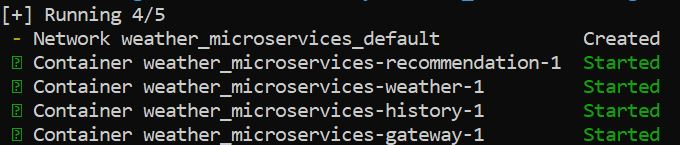
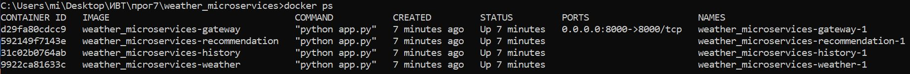

# Вариант №1: Агрегатор погодных данных

Сервис получения погоды: [weather_service](https://github.com/hbjnmcd/prog7/tree/main/lr2/weather_service)

Сервис рекомендаций: [recommendation_service](https://github.com/hbjnmcd/prog7/tree/main/lr2/recommendation_service).

Сервис истории запросов: [history_service](https://github.com/hbjnmcd/prog7/tree/main/lr2/history_service).

Для того, чтобы все сервисы работали, был создан сервис-связка - [gateway](https://github.com/hbjnmcd/prog7/tree/main/lr2/gateway)

Работа контейнеров:

.

.
