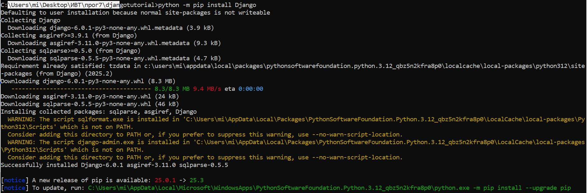
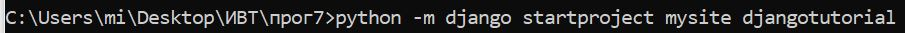
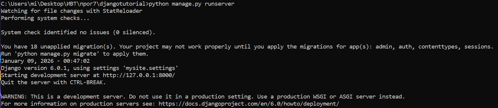
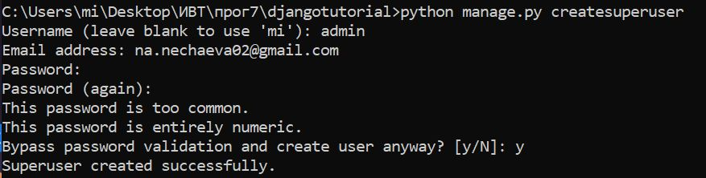
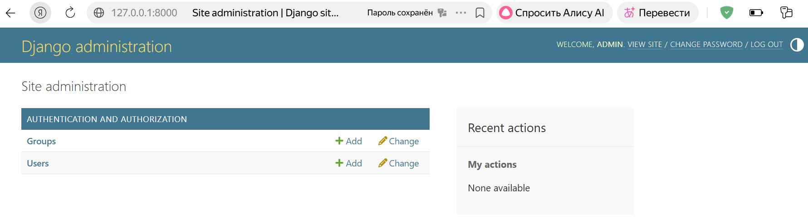
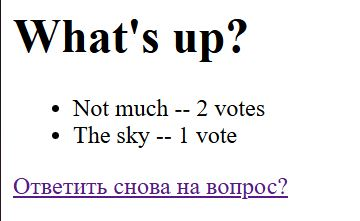
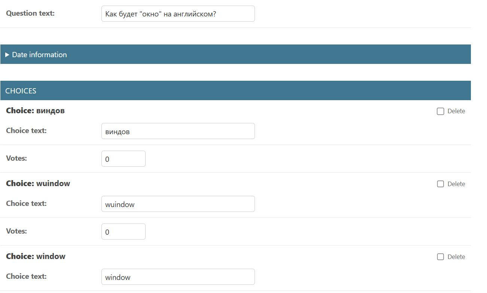
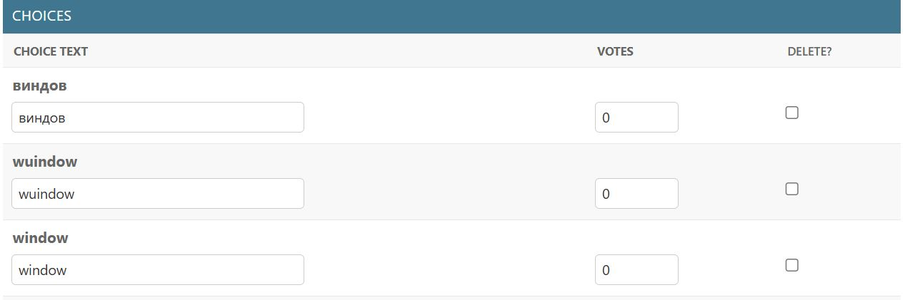
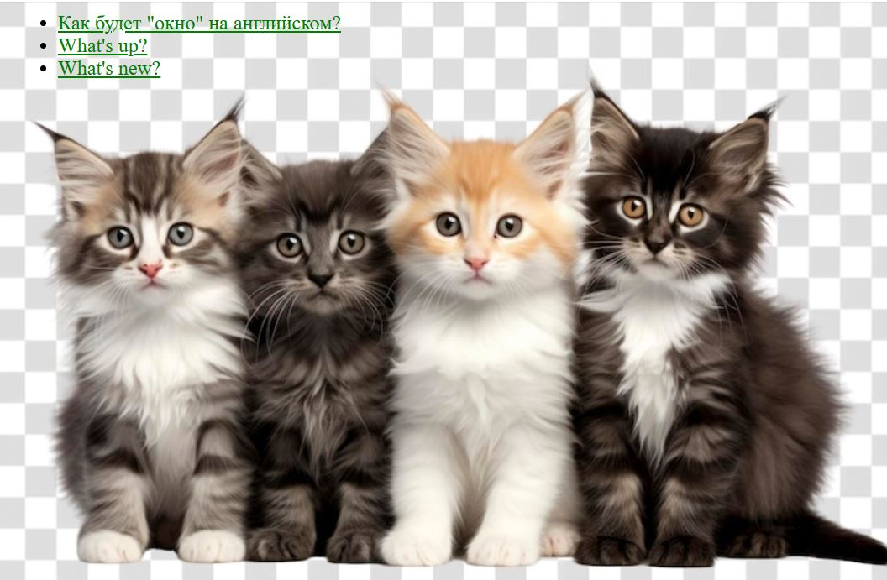

### Скачивание Django

### Создание проекта

### Созданы файлы (автоматически)

### Первый запуск

### Создание админа

### Проверка - админ работает

### Ответы считаются

### Можно создавать руками вопросы и ответы на вопросы

### Фон изменен

